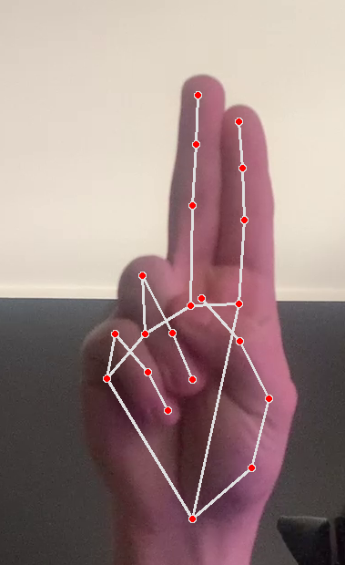
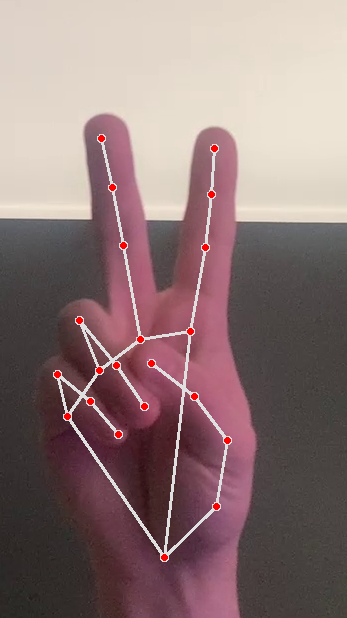
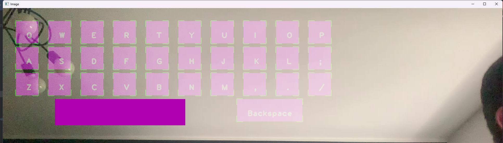

# Virtual keyboard 
## The program runs in python 3.8.10
A simple program that displays the keyboard on the image of the camcorder a click on the 
button is based on the approximation of the fingers to each other. 
When you place the cursor, for example in a notepad, the letters clicked on the keyboard will be typed in 

